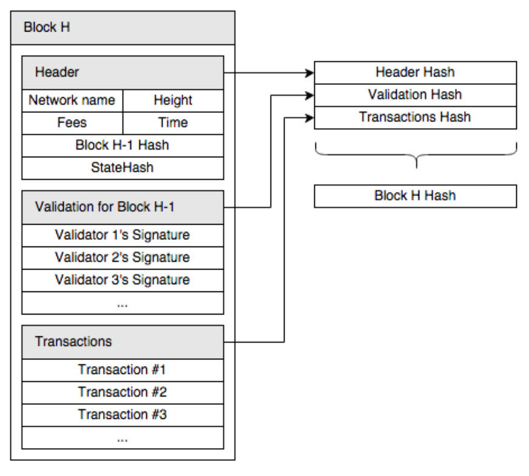

# Tendermint Core

As part of the interview process for Evmos, 
the following notes on the functionality and concepts of Tendermint Core
were written up.  
If you are wondering 
about the structure of the .md file itself, 
I am adhering to [semantic linefeeds](https://rhodesmill.org/brandon/2012/one-sentence-per-line/) 
as a means to improve tracking text changes with Git.

## Contents

- [General Info about Tendermint](#general-info-about-tendermint)
  - [Definitions](#definitions)
  - [Motivations behind Tendermint](#motivation-behind-tendermint)
    - [Environmental Impact](#environmental-impact)
    - [Software Engineering](#software-engineering)
    - [Ecosystem Growth](#ecosystem-growth)
    - [State Machine Replication](#state-machine-replication) (SMR)
  - [Possible Exploits](#possible-exploits)
- [Predecessors of Tendermint Consensus](#predecessors-of-tendermint-consensus)
- [Byzantine Fault Tolerance](#byzantine-fault-tolerance) (BFT)
- [Tendermint Consensus Process](#tendermint-consensus-process)
  - [Notes](#notes-on-consensus-mechanism)
- [Application Blockchain Interface](#application-blockchain-interface-abci) (ABCI)
  - [Implementation Details](#implementation-details)
- [ABCI++](#abci)
  - [Motivation for ABCI++](#motivation-for-abci)
  - [Implementation](#implementation)
  - [Points of Caution](#points-of-caution)
  - [Outlook](#outlook)
- [Application Architecture](#application-architecture)
- [Meaning of Tendermint for Cosmos](#meaning-of-tendermint-for-cosmos-sdk)
- [Synchrony, Asynchrony, Partial Synchrony](#synchrony-asynchrony-partial-synchrony)
- [Safety and Liveness - FLP impossibility](#safety-and-liveness---flp-impossiblility)
  - [Casper](#casper)
- [Finality](#finality)
- [Random Things](#random-things)
  - [Block Structure](#block-structure)

## Reference topics

 - What is Byzantine Fault Tolerance (BFT)? Why is BFT relevant in the context of blockchains
 - Understand what finality means in blockchains.
 - Explain and understand the tradeoffs of safety over liveness (i.e BFT vs Nakamoto Consensus chains). Why does this matter and what are the restrictions for design?
 - What is Synchrony, Asynchrony, Partial Synchrony? Why is it relevant to Tendermint?
 - Explain how an application communicates with the Tendermint Consensus Engine (ABCI). How does it relate to Cosmos and the Cosmos SDK?
 - What is ABCI++? Explain the differences with ABCI its problems/limitations that motivated the new ABCI++ specification. What are the new phases/methods introduced in the Consensus/block execution phase?

## General Info about Tendermint

"Tendermint in a nutshell": https://docs.tendermint.com/master/assets/img/tm-transaction-flow.258ca020.png

https://docs.tendermint.com/master/  
https://docs.tendermint.com/master/introduction/what-is-tendermint.html

In any PoS blockchain application
three main layers of concern have to be addressed:

- Networking (P2P communication)
- Consensus
- Application layer

Tendermint is a blockchain application platform, 
built to serve the two ground layers of networking and consensus
in a standardized way,
so that new blockchains can be developed on top of it.
This has the advantage, 
that blockchain developers primarily have to be concerned with
building the application layer, 
and with that, their business logic.
 
It can be compared to a web-server for web applications,
where the web developer only has to build the website logic,
instead of rewriting the HTTP protocol.

To achieve this, 
it applies state machine replication (SMR)
for any deterministic, finite state machine,
whilst being byzantine fault tolerant (BFT).

Tendermint itself consists of two major components:
  
- [Blockchain consensus engine](#tendermint-consensus-process) (Tendermint Core) 
- [Application Blockchain Interface](#application-blockchain-interface-abci) (ABCI)

### Definitions

*State machines*:  
A state machine is basically a black box, 
which takes an input, 
contains state variables, 
which define the system state, 
and changes these in response to the input
[[She11]](https://blog.markshead.com/869/state-machines-computer-science/).

*Finite state machines*:  
A finite state machine cannot describe continuous state changes,
but rather describes a finite amount of possible states
(e.g. unlike water levels in a pool or very simply the length of a line).
[[She11]](https://blog.markshead.com/869/state-machines-computer-science/).

*Deterministic state machines*:  
Deterministic means, that the same result is always achieved 
when given the same initial conditions 
and the same requests
between states.
Sources of non-determinism can be arbitrary:
hardware failures, node-dependent state (e.g. time or random numbers),
race conditions, floating-point numbers, map iteration in Golang, ...
[[ABCI++ docs]](https://docs.tendermint.com/master/spec/abci++/abci++_basic_concepts.html)
[[She11]](https://blog.markshead.com/869/state-machines-computer-science/).

*State machine replication*:  
In distributed systems, it ideally is achieved, 
that the machine instructions are executed on every participant of the system.
This can be done through state machine replication (SMR).
[[Sch90]](https://link.springer.com/chapter/10.1007/BFb0042323).

*Distributed systems*:  
Distributed systems are defined as being processors, 
which are physically and electrically isolated.

### Motivation behind Tendermint

There are several perspectives, 
from which Tendermint tried to improve on existing architecture.

#### Environmental Impact
Proof-of-Work algorithms such as the one used in Bitcoin 
have a large environmental impact,
as the security of the chain 
lies in solving a complex mathematical problem,
the complexity of which can be adjusted,
so that solutions to the problem are found, 
and therefore new blocks mined,
at a desired throughput rate.  
As more and better processors tackle this challenge,
and PoW blockchains in general become more widely used,
the environmental footprint of this operation severely increases.  
Proof-of-Stake algorithms, which Tendermint and others use,
require much less computational effort 
[[p.1, Kwo14]](https://www.semanticscholar.org/paper/Tendermint-%3A-Consensus-without-Mining-Kwon/df62a45f50aac8890453b6991ea115e996c1646e).

#### Software Engineering
Before Tendermint, all blockchains had to include 
custom software to establish the peer-to-peer connections, 
broadcast transactions, 
handle the mempool, 
reach consensus, 
keep track of accounts, balances and contracts, 
etc. 
 
The projects which were around at the time
like Bitcoin and Ethereum
have large, interconnected and monolithic codebases,
which are a typically seen as a bad practice in software design, 
as modules are strongly coupled
and cannot not be used or developed separately.
 
A separation of concerns is achieved by Tendermint.

#### Ecosystem Growth
Handling consensus and networking, 
and only leaving the application details to blockchain developers
lowers the cost of entry into the ecosystem
only offer the base layers, 
which are concerned with networking and consensus.

#### State Machine Replication
Classic SMR algorithms concerned themselves with
a small amount of connected machines,
that were often in the same network,
and all participants could be trusted.  
Blockchains on the other hand are networks 
of hundreds or thounsands of nodes,
which can be in arbitrary locations
and the participants do not know each other.
Additionally, nodes are usually only
connected to their peers, 
which is a subset of the total system. 
These peers communicate through a gossip protocol
[[p.1, BucKwoMil18]](https://arxiv.org/abs/1807.04938). 
 
Tendermint introduced a new termination mechanism,
to prevent endless rounds and nodes from blocking
[[p.5, BucKwoMil18]](https://arxiv.org/abs/1807.04938):

### Possible exploits

*Nothing at stake problem*:  
When network participants do not face a high enough incentive 
to not act maliciously,
it is the best strategy for validators
to accept all forks
to ensure they receive block rewards
from whichever chain is the correct one.
This could mean a malicious fork could win over
the network
[[Oba22]](https://medium.com/minima-global/finality-in-blockchain-e5a62ca0f9f4)
[[p.1, Kwo14]](https://www.semanticscholar.org/paper/Tendermint-%3A-Consensus-without-Mining-Kwon/df62a45f50aac8890453b6991ea115e996c1646e).

*Long range double-spending attacks*:  
A 2/3 majority of validators unbond their assets 
and sell their coins to others, 
who are not aware of any malicious activity. 
Then, they publish a fork of the blockchain, 
but have already made profit from the selling of the now double-spent coins.
[[p.4, Kwo14]](https://www.semanticscholar.org/paper/Tendermint-%3A-Consensus-without-Mining-Kwon/df62a45f50aac8890453b6991ea115e996c1646e).

*Short range double-spending attacks*:  
This describes a blockchain fork,
which has happened at such a recent time,
that the malicious validators could not unbond their assets yet. 
In this case, the bonded assets of the validators can be slashed,
who participate in the fork.  
However, this means, that >1/3 of bonded assets are destroyed at once,
which is still damaging the network as a whole.  
By adjusting the bonding requirements to become a validator,
the probability for these kinds of attacks can be adjusted
[[p.4, Kwo14]](https://www.semanticscholar.org/paper/Tendermint-%3A-Consensus-without-Mining-Kwon/df62a45f50aac8890453b6991ea115e996c1646e).

*Censorship attacks*:  
The liveness of the blockchain can be compromised
if +1/3 of the voting power decides to withhold any precommit votes.
In this case, no blocks can be produced
and the attackers can control the reduction of throughput of the blockchain
or bring it to a halt altogether.

If malicious behavior in form of double-voting 
or light client attacks is suspected by a node
an `Evidence` message can be sent
to notify the network of this behavior. 
It is up to the application layer to evaluate the evidence
and punish the actors
[[ABCI Docs]](https://docs.tendermint.com/master/spec/abci/abci.html) 
[[ABCI++ docs]](https://docs.tendermint.com/master/spec/abci++/abci++_basic_concepts.html)
[[Evidence Docs]](https://docs.tendermint.com/master/spec/consensus/evidence.html).

## Predecessors of Tendermint Consensus

Direct predecessors of Tendermint consensus are the pBFT 
[[CasLis02]](https://www.microsoft.com/en-us/research/wp-content/uploads/2017/01/p398-castro-bft-tocs.pdf) 
and DLS algorithms
[[DwoLynSto88]](https://arxiv.org/abs/1807.04938):
  
- Tendermint has three communication steps per round like pBFT
(proposal + two voting steps)

- Tendermint uses different block proposers each round as in DLS

## Byzantine Fault Tolerance

BFT solves the Byzantine Generals Problem,
which describes a group of generals, who have a common mission (=well-being of the blockchain). 
They can only communicate with messages (=P2P communiation)
and some of the generals might be traitors (=malicious nodes)
or messengers might be captured (=timeout).
 
The generals must follow an algorithm, so that
loyal generals decide upon the same plan (=block),
and a small number of generals (=byzantine nodes)
cannot cause the loyal generals to follow a malicious plan (=propose false block).
 
In order to achieve this, 
communication has to be such that
all loyal generals vote on the same plan (=ensure that exact block is communicated in current round).
Then, majority voting is used to determine if the plan should be followed (=consensus process).
 
The generals take into consideration all votes
that are communicated to them within a given timeframe (=timeouts in algorithm) 
and count all others as votes against the plan.
 
Using signed messages (=public key cryptography),
the generals can ensure the authenticity of the message
(=algorithm allows for easy verification).
 
A distributed system can be considered byzantine fault tolerant,
if it continues to produce correct results, 
even if 1/3 of all participating subsystems 
are fraudulent or misbehaving in any other way 
(e.g. being broken, failing to connect, ...).
 
BFT algorithms are especially suited to distributed networks
as they are agnostic of the type of errors that can occur.
It only is concerned with the answer that it does get,
and does not depend on getting an answer from every network participant.
 
BFT allows an arbitrary amount of failures over the lifetime of the system
as long as not more than 1/3 of the voting power fails at once
[[LamShoPea16]](https://www.microsoft.com/en-us/research/uploads/prod/2016/12/The-Byzantine-Generals-Problem.pdf)
[[CasLis02]](https://pmg.csail.mit.edu/papers/bft-tocs.pdf).

BFT is robust to *denial of service* attacks in the way, 
that the nodes endure not producing correct results during the attack
but resume reaching consensus once the attack ends. 
This is a useful quality as denial of service attacks are much more common
than actually hacking a network node.

## Tendermint Consensus Process

https://docs.tendermint.com/master/assets/img/consensus_logic.e9f4ca6f.png

Tendermint achieves BFT SMR
by sequentially reaching consensus on new blocks,
that shall be appended to the canonical representation of the blockchain.
These blocks include transactions, 
which update the state variables of the system.  
The consensus is organized into voting rounds,
where for each round a new validator is chosen from the validator set
to propose a new block.
This is handled by a deterministic function (not at random),
which selects validators in a pattern relating to their bonded assets
[[p.6 Kwo14]](https://www.semanticscholar.org/paper/Tendermint-%3A-Consensus-without-Mining-Kwon/df62a45f50aac8890453b6991ea115e996c1646e).

A single round consists of at least three and at most 5 steps:  
*Propose*, *prevote* and *precommit* happen in every round, 
whereas *commit* and *new height* only occur if consensus on a block was reached
[[p.5 Kwo14]](https://www.semanticscholar.org/paper/Tendermint-%3A-Consensus-without-Mining-Kwon/df62a45f50aac8890453b6991ea115e996c1646e).

In the first round at a new block height 
(=after the last block was committed),
the proposer can freely choose 
which transactions from the mempool to include in the proposed block. 
The proposed block is forwarded to the validator's peer nodes. 
These check the proposed block (=value $v$) for validity
and sign a *prevote* message containing $id(v)$. 
If the prevote timeout expires before sending the message,
the node could not identify the block as valid,
or no proposal has reached the node,
`nil` is sent as the prevote value.  
When a node receives a block proposal and $2f+1$ prevote messages containing $id(v)$,
it sends a *precommit* message with $id(v)$. 
Again, in the case that
$2f+1$ prevotes are not received 
before the precommit timeout is expired, 
a precommit message containing `nil` is sent. 
If a node receives a block proposal as well as $2f+1$ precommit messages,
it decides, that this block will be committed
and signs a *commit* message. 
If the node has not received the actual block during the previous steps,
it is supplied with it during the *commit* step. 
The contained transactions are executed in a *subjective commit*.
All commit messages are broadcasted to the network.
After commiting, a certain period of time is waited,
to include commit signings from slower validators. 
When a node receives notice, that a 2/3 majority of validators
will commit this specific block,
the CommitTime is written to the block header
and the *NewHeight* step is invoked in order to run the *canonical commit*.  
Then, the next block is proposed
[[p.1, 4, 7f. BucKwoMil18]](https://arxiv.org/abs/1807.04938)
[[p.4, 6-8 Kwo14]](https://www.semanticscholar.org/paper/Tendermint-%3A-Consensus-without-Mining-Kwon/df62a45f50aac8890453b6991ea115e996c1646e)
[[Consensus Docs]](https://docs.tendermint.com/master/spec/consensus/consensus.html).

When a round terminates without consensus on a new block,
i.e. less than 2/3 majority has casted a commit vote,
a new round starts.
In order to achieve consensus when timeouts are the cause of non-consensus,
the timeout values are increased with each starting round.

*Commit* messages are special, 
because they are always broadcasted in any step or step.
If a node receives a 2/3 majority vote for commiting a block,
even though the node itself was only in the prevote round,
the commit stage is entered
[[p.8 Kwo14]](https://www.semanticscholar.org/paper/Tendermint-%3A-Consensus-without-Mining-Kwon/df62a45f50aac8890453b6991ea115e996c1646e).

  

Tendermint also implements locking rules, so that 
validators do not commit different blocks at the same block height.
The validator is locked to the block 
when pre-commiting a block.
It must pre-vote the block
and can only unlock
if there is a polka for another block in a later round.

### Notes on consensus mechanism

- Also, unlike in predecessor algorithms (PBFT, DLS),
does not include actual messages, 
when voting,
but rather cryptographic proof of the message contents
[[p.2-3, BucKwoMil18]](https://arxiv.org/abs/1807.04938).

- There is only one "mode", 
meaning that the same rounds are completed,
whether or not a valid block is proposed
and sufficient votes are collected
[[p.3, BucKwoMil18]](https://arxiv.org/abs/1807.04938).

- Through use of cryptographic signatures,
no "fake" messages from different senders can be generated 
[[p.4, BucKwoMil18]](https://arxiv.org/abs/1807.04938).

- Based on Validity Predicate-based Byzantine consensus,
which has three main properties [[p.4-5, BucKwoMil18]](https://arxiv.org/abs/1807.04938):

  - Agreement: Non-malicious nodes will always decide
  on the same values.

  - Termination: 
  All participating nodes will produce a decision 
  (either nil or pre-vote/pre-commit)

  - Validity:
  Application-specific --> e.g. in terms of blockchain 
  a block is not valid if it doesn't contain the hash of the last block.

- Tendermint (and other BFT algorithms) works, 
if not more than 1/3 of nodes are misbehaving 
(with or without malicious intent)
[[p.5, BucKwoMil18]](https://arxiv.org/abs/1807.04938).

- A fork (=two blocks at the same height get a 2/3 majority vote) can only happen,
if >1/3 of validators try to double sign.
[[p.4 Kwo14]](https://www.semanticscholar.org/paper/Tendermint-%3A-Consensus-without-Mining-Kwon/df62a45f50aac8890453b6991ea115e996c1646e).

- Messages with invalid signatures
are removed before entering the mempool 
[[p.4, BucKwoMil18]](https://arxiv.org/abs/1807.04938).

- If a block is not committed, 
the next round is started at the same block height

- In order to commit a block, all checks must be passed, 
as well as two stages of voting (pre-vote and pre-commit)

- All voting rounds need a 2/3 majority vote, 
in order to pass the proposed block on to the next stage

- "Polka" = more than 2/3 of the validator set pre-vote for the same block

- In PoS applications (like all Cosmos based blockchains), 
2/3 of voting power 
and not 2/3 of actual validators 
have to reach consensus

- When using PoS applications, 
the validators can be forced
to bond the chain currency in a security deposit
which will be slashed when misbehaving
with regards to the consensus protocol.

- The Tendermint PoS algorithm does not benefit those,
who try to claim a bigger share of the fees
by removing a certain amount of signatures:
[[p.9 Kwo14]](https://www.semanticscholar.org/paper/Tendermint-%3A-Consensus-without-Mining-Kwon/df62a45f50aac8890453b6991ea115e996c1646e).

  - Expected benefit:
  $\sum Fees * v_a * v_p * v_p$

  - Expected detriment:
  $\sum Fees * v_a * v_p$

Because $v_i < 1$, the benefit will always be smaller than the detriment.

## Application Blockchain Interface (ABCI)

https://docs.tendermint.com/master/introduction/what-is-tendermint.html  
https://github.com/tendermint/tendermint/tree/master/spec/abci/

The Application Blockchain Interface (ABCI) is the interface
to feed input from an abitrary state machine
written in any language 
to the Tendermint SMR engine. 
Its implementation in Tendermint is called the Tendermint Socket Protocol (TSP). 
All actions on the actual data stored in the blockchain
go through the ABCI.
For this purpose, the interface exposes methods 
for querying, updating and adding new data.
The ABCI messages and methods are defined in [protocol buffers](https://en.wikipedia.org/wiki/Protocol_Buffers), 
which makes the interface agnostic to the programming language of the application, 
with which it communicates [[Docs]](https://docs.tendermint.com/master/spec/abci/).

### Implementation details

Depending on the implementation,
these are called directly within Go code or by
by sending a `Request*` message to the ABCI via socket or gRPC.
In return, the ABCI sends a `Response*` message.  
The ABCI comprises three primary types of socket connections 
[[ABCI Docs]](https://docs.tendermint.com/master/spec/abci/abci.html):

1. *Mempool connection*  
`CheckTx`  
Responsible for validating new transactions 
before being shared 
or included in a block.  
Called whenever a transaction is added to Tendermint Core  
Checks if the transaction is valid 
(wrong nonce, request format, signatures, ...).

2. *Consensus connections*  
`InitChain`, `BeginBlock` -> [`DeliverTx`] -> `EndBlock` -> `Commit`  
Responsible for block execution.  
Upon starting a new blockchain, `InitChain` is called.
When a new block is decided on,
by reaching consensus with Tendermint Core,
this flow of function calls is executed.  
The actual transaction 
is sent to the application
using `DeliverTx`.
This method is called 
once for every transaction
included in the proposed block.
`Commit` is called 
to permanently store the transaction
on chain.  
The header of the next committed block
contains cryptographic traces of the execution
of `DeliverTx`, `EndBlock`, and `Commit`.

3. *Info connections*  
`Info`, `SetOption`, `Query`  
Responsible for user queries and initialization.  
Called in order to know
if a given key exists
and if it does,
what its stored value is.

Additionally, the following special methods exist:

4. `Flush`, `Echo`, `ListSnapshots`, `OfferSnapshots`, `LoadSnapshotChunk`, `ApplySnapshotChunk`  
`Flush` is a method, 
which is called on every connection, 
and `Echo` serves debugging purposes. 
The different `Snapshot` methods
help new nodes, that enter the distributed system,
to get up to date with the blockchain state.
This has the advantage,
that not every node has to recompute all previous state changes.

https://docs.tendermint.com/master/tutorials/go-built-in.html  
https://docs.tendermint.com/master/assets/img/abci.3542de28.png

## ABCI++

ABCI++ is the further development of the 
Application Blockchain Interface, which
addresses many limitations of the protocol,
that have been witnessed in production,
since the algorithm first was introduced.

### Motivation for ABCI++

With ABCI, the application layer has no control over the proposed blocks
and the transactions contained in them. This means, that 
transactions, that are in itself well formed, but 
are in fact garbage transactions or otherwise invalid,
are included in proposed blocks and 
then executed in the replicated chain state. 
The mechanism also is not robust against byzantine block proposers,
who e.g. flood the network with garbage transactions.
Finally, mempool front-running is not handled well.
 
From the API point of view, the separated design to finalize a block
using `BeginBlock`, `EndBlock` and sequentially executing `DeliverTx` for every transaction in the block
limits the possibilities of concurrent execution,
as only one ABCI process can be active at a time.
[[Men22]](https://www.youtube.com/watch?v=cAR57hZaJtM)

These proposed changes to the ABCI specification are aimed
at improving scalability, 
by enabling block proposers and validators to do more
than just executing finalized transactions 
in a serialized fashion.

### Implementation

As discussed before, in total there are 
four types of connections to the ABCI
[[Wai21]](https://www.youtube.com/watch?v=UuDrSpo_Q-I&t=618s):

- Consensus: `BeginBlock`, `DeliverTx`, `EndBlock`, `Commit`
- Mempool: `CheckTx`
- Info: `Info`, `Query`, `InitChain`
- StateSync: `ListSnapshots`, `OfferSnapshot`, `LoadSnapshotChunk`, `ApplySnapshotChunk`

The changes between ABCI and ABCI++ mainly addressed the consensus engine.
It is designed to open up possibilities and add more control
for developers.
 
Some of the addressed downsides of the old ABCI are:
- No filtering of bad transactions
- No room for concurrency (each transaction is executed sequentially)
- Less overall application control (app had no control over consensus)

On top of that, ABCI++ enables developers to choose 
between having delayed or immediate agreement
in their blockchains.
 
With ABCI++ there are now more possibilities
to interact with the application layer
at multiple points in the consensus process
[[Wai21]](https://www.youtube.com/watch?v=UuDrSpo_Q-I&t=618s)
[[Men22]](https://www.youtube.com/watch?v=cAR57hZaJtM)
[[Ojh21]](https://www.youtube.com/watch?v=jHcI3jFgp_E)
[[ABCI++ docs]](https://docs.tendermint.com/master/spec/abci++/abci++_basic_concepts.html):

*Preparing the proposal* (`PrepareProposal`) 
Tendermint grabs the transactions from the mempool
and communicates them to the network. 
In ABCI++ it is now possible to prioritize transactions in the mempool.
Additionally, the application layer can 
add own transactions,
remove transactions (invalid or garbage/spam tx),
merge transactions (batching),
reorder transactions.
 
This is a key factor for improved performance.
 
With the new support for *immediate execution*,
the block contents can be executed and
the app hash for the proposed block 
can be already returned and added in the current block,
as opposed to in the following block as for the
previously only way (delayed agreement).   
The changes to the application state 
are only precomputed and stored until `FinalizeBlock`,
instead of immediately updating the state 
(because consensus on the changes was not reached yet).
 
When using *same-block execution*, 
the `ResponsePrepareProposal` contains information 
about the processed block.

*Processing the proposal* (`PrepareProposal`) 
The proposed block is gossiped to the network.
All nodes validate the proposal and vote nil 
if they cannot validate the proposed block.
In ABCI++ it is now possible for the application layer
to have implemented logic, 
that can evaluate if a proposed block should be accepted or not.
Because checking the validity of a block 
is extended to the application layer,
it is called *external validity*.
This specifically allows to filter byzantine block proposals.
 
The block contents can be executed *immediately*
upon processing a proposal,
similar to `PrepareProposal`
and bad proposals can be rejected.

*Extending votes* (`ExtendVote`, `VerifyVoteExtension`) 
Happens in the precommits only.
The applications can now allow validators 
to add data (e.g. transactions) to the block
which is signed by the validator. 
 
When a node receives a message containing a vote plus a signed extension,
it can check the extension with `VerifyVoteExtension` 
in order to identify any bad behaviour.
If an extension cannot be verified,
it is indicative of a byzantine actor 
and the whole message is rejected.
 
It is important to note, that 
the data in the extensions is not agreed on by consensus (=not included in proposed block)
but is available only on the current block height.
 
The vote extension can be useful for price oracles to gather more accurate data.

*Finalizing the block* (`FinalizeBlock`) 
Instead of separating the function calls 
(`BeginBlock`, `DeliverTx`, `EndBlock`, `Commit`)
and defining a very specific interface,
the ABCI++ now allows the developers
to handle the block in its entirety.
This gives more freedom in 
executing the contained transactions, 
especially concerning concurrent execution.
 
With immediate agreement, the block contents were already executed.
There is only an approval of the execution happening in that case.

*ABCI concurrency* 
Previously, calls to the ABCI could only be handled in a serialized way.
For example, if a `CheckTx` is running, 
no other operation can be executed.
ABCI++ now allows for concurrent method calls.

### Next-block execution vs. same-block execution

With the introduction of `PrepareProposal` and `ProcessProposal`,
the option of using *same-block execution* exists.
This means, that the transactions are executed 
already at block proposal,
the block header is formed, 
and the transactions results stored.
In the traditional way, only *next-block execution* was possible,
because the transactions were only executed at Commit and 
its block hash and results 
could only be included in the next block.
In both cases, the application state
is only updated once the block is committed.

When using *same-block execution*, 
the `ResponsePrepareProposal` contains information
about the processed block, 
like transaction results and header data.

In the case of *next-block execution*,
the `ResponsePrepareProposal` contains empty fields
for the processed block information.

### Points of Caution

With the newly gained freedom for developers
to precisely adjust the consensus behaviour 
for their specific application needs
also come sensitive points to keep in mind.

Because the application layer now can 
implement additional logic 
which a proposed block has to fulfill,
there are now block proposals,
which are rejected,
that were previously accepted.
This affects liveness 
and should be considered 
by any developer who makes use of the mechanisms.
 
As a general rule, it is recommended, 
that `ProcessProposal` and `VerfifyVoteExtension`
should accept proposals even with invalid transactions as part of the block
for the sake of liveness 
and just ignore said transactions at block execution.

Because of these changes,
Tendermint poses some requirements on the application layer.
The application has to guarantuee 

- *determinism* 
(i.e. when `ProcessProposal` accepts a block on one correct machine,
it accepts it on all correct machines)
- *coherence* 
(i.e. when a block proposal is modified by one correct machine,
the same exact data is processed on two processors,
both machines come to the same decision)

Concerning timing, it must be mentionend,
that immediate execution requires more time for a block proposal to be done.
It is possible, that timeouts are missed and 
consensus cannot be reached [[ABCI++ Docs]](https://docs.tendermint.com/master/spec/abci++/abci++_basic_concepts.html).

A developer must be careful in utilizing the options.
For example, to ensure the integrity of a running blockchain,
the use of *same-block* vs. *next-block* execution 
must not be changed while live.
Also, memory usage must be handled with case,
as consensus might not be reached for a couple of rounds
and the stored executed transactions in the proposed blocks
will add up. 
It might make sense to delete the execution results
after a couple of failed rounds and 
recalculate them when needed.
 
As a different example, it is now possible to 
have concurrent calls to the ABCI++ methods.
It is up to the application 
to handle the concurrency of method calls.
 

### Outlook

In the future, the `Commit` method is going to be 
included in `FinalizeBlock` as well. 

## Application Architecture

The basic signal flow 
when using a blockchain application, 
that is built with Tendermint,
is described here [[App Arch. Docs]](https://docs.tendermint.com/master/app-dev/app-architecture.html):

- End-user communicates with application
to create a transaction
or query some information from the blockchain.

- The application logic checks
whether the user request is valid
and reroutes the request
to the Tendermint Core RPC

- Tendermint then delivers
the transaction or query
to the ABCI

- The ABCI is responsible for 
the actual update of the chain state
or querying the desired information.

## Meaning of Tendermint for Cosmos SDK?

From :

"[...] it is recommended that applications not be exposed to any external user or process except via the ABCI connections to a consensus engine like Tendermint Core. The application must only change its state based on input from block execution (BeginBlock, DeliverTx, EndBlock, Commit), and not through any other kind of request. This is the only way to ensure all nodes see the same transactions and compute the same results."

--> this states, that in order to guarantee 
the expected/desired deterministic behavior 
on all participating machines,
it is mandatory
to only update the chain state 
using the ABCI, 
which is encapsuled by Tendermint Core.
No direct requests to the application layer
should be able to change state variables.
[[Determinism Docs]](https://github.com/tendermint/tendermint/blob/master/spec/abci/abci.md#Determinism).

This is supported by [[p.4, BucKwoMil18]](https://arxiv.org/abs/1807.04938),
where it is stated,
that transaction verification should be handled by the application
that uses Tendermint.

## Synchrony, Asynchrony, Partial Synchrony

Distributed systems can be classified into 
synchronous, asynchronous and partially synchronous systems.

Fully asynchoronous systems do not hold any assumptions about the time 
it takes to communicate between nodes
or the speed at which instructions can be processed at the receiving end (=computing power). 
Fully synchronous systems can guarantee, 
that messages are correctly communicated
and processed within a known timeframe. 
Partially synchronous systems can present hybrid forms of these two extremes,
where certain constraints are defined 
and freedom is given on the other side. 

It was shown by research, that
fully ansynchronous systems cannot reliably achieve consensus.
Hence, some limitations have to set
[CasLis02](https://www.microsoft.com/en-us/research/wp-content/uploads/2017/01/p398-castro-bft-tocs.pdf).

The consensus algorithm in Tendermint 
can be considered **weakly** or **partially synchronous**,
because it assumes, that there is an upper bound $\Delta$,
after which all messages are delivered.
This describes the real-world phenomenon, 
that previously unknown latency will be present in the system,
but that this latency will not be endless,
if the network participants are not offline.  
This means, that all communication is done at time $t_{end} = \max\{t_{msg}, GST\} + \Delta $,
where $GST$ is the Global Stabilization Time.
[[p.3, BucKwoMil18]](https://arxiv.org/abs/1807.04938)
[[p.1-3, DwoLynSto88]](https://arxiv.org/abs/1807.04938).
 
This is implemented by means of several `timeout` values,
after which a `nil` message is signed,
if the node has not responded yet.
Before the global stabililization time (GST),
the timeouts are increased after each round, 
if a sufficient value was not found before,
so that eventually, consensus will be reached
[[p.5, Kwo14]](https://www.semanticscholar.org/paper/Tendermint-%3A-Consensus-without-Mining-Kwon/df62a45f50aac8890453b6991ea115e996c1646e).

If validators are offline, lagging, etc. 
they can be skipped in Tendermint.
Any validator waits a certain, small amount of time
to receive a proposal block from the proposing validator
before jumping to the next voting round
and abandoning the currently proposed block.

## Safety and Liveness - FLP impossiblility

In distributed systems like blockchains, 
the participant nodes must execute the correct instructions
to secure the correct behaviour of the system.
To do this, all nodes must reach consensus 
at a given decision round (=block height in blockchains).
*Safety* describes the property,
that if consensus is reached
all nodes produce the exact same block at the same height
(="a bad thing never happens").  
To guarantee, that consensus is always reached
and chain execution never halts,
is favoring *liveness* of the system 
(="a good thing will eventually happen").  
When a distributed system is *fault tolerant*,
it can deal with one or more faulty network participants
and still produce correct results through consensus
[[Kim18]](https://medium.com/codechain/safety-and-liveness-blockchain-in-the-point-of-view-of-flp-impossibility-182e33927ce6)
[[p.3, DwoLynSto88]](https://arxiv.org/abs/1807.04938).

FLP impossiblility describes the characteristic, that
out of the three properties *safety*, *liveness* and *fault tolerance*,
only two can be guaranteed. 
In globally distributed systems, like blockchains,
where communication can fail
and network participants do not necessarily trust each other,
fault tolerance **must** be given.  
This means, that blockchain algorithms can choose between implementing
safety or liveness.

In Nakamoto consensus (e.g. Bitcoin),
the liveness is guaranteed over safety.
It is possible, that forks of the chain can exist,
which means, that different blocks have been created at the same height,
but a longest chain (i.e. the one with the most work) will form
and thus, consensus will be reached (="something good will eventually happen").
Even when faulty blocks are produced, then chain will not halt.

In BFT algorithms (e.g. Tendermint) on the other hand,
a block cannot be produced if consensus is not reached,
since a 2/3 majority vote is necessary.
Hence, if consensus is not reached in multiple rounds,
the throughput is reduced
and the chain might eventually come to a halt.
This means, that safety is preferred over liveness
[[Kim18]](https://medium.com/codechain/safety-and-liveness-blockchain-in-the-point-of-view-of-flp-impossibility-182e33927ce6).
 
This poses additional requirements on the validators, 
which have to be able to be online 
almost 100% of the time
for distributed consensus 
to timely be executed.

**Hybrid algorithms**

Alternate algorithms have been proposed,
like *Hot-Stuff*, where socalled *commit-certificates* can be contained in the blocks.
Even blocks without these can be produced, they are just not final in the blockchain
until further requirements are met. This partly sacrifices safety for liveness.
 
Also, there are two Casper implementations, that provide a 
*chain-based* Proof of Stake.

### Casper
There are two implementations of PoS principles for the Ethereum stack:
- Casper the Friendly Finality Gadget (CFFG)
- Casper the Friendly GHOST (CTFG)

*Casper the Friendly Finality Gadget* is a derivation of PoS principles to a PoW blockchain.
On top of the liveness favoring PoW chain, 
voting rounds are introduced at every 50 blocks 
to preserve safety at those points.
It also includes slashing of malicious actors' assets.
Any long-range attacks on this chain are ignored,
as no blocks older than the last safety point can be reverted.
 
The staking happens not in a form of a native staking coin
but by depositing ETH in a smart contract.
There is a validator set derived,
which vote once per epoch (=50 blocks).
In order for a block to be finalized, 
two rounds of voting (as in Tendermint)
have to be won.
In the first round, the block is justified
and the block of the previous epoch is finalized
if it gets a 2/3 majority of the voting.
The finalized block becomes the *Last Finalized Epoch* (LFE).
This means, that a block is only finalized 
up to 100 blocks after its creation.
 
*Casper the Friendly Ghost* is a 
Proof of Stake adaptation of the GHOST protocol.
*Greedy Heaviest Observed SubTree* describes an algorithm,
where in case of a fork in the blockchain,
the heaviest subtree instead of the longest chain
is selected as the canonical representation of the chain state.
Instead of voting on blocks proposed by a selected leader,
the voting is based on the blocks,
which the validators have observed.
This implies, that validators will vote on the authenticity 
of the heaviest subtree,
that they have witnessed.
This means, that the production of blocks is not dependent on consensus
and the system guarantuees availability.

The Casper implementations would allow for a much larger validator set
than in Tendermint
because consensus is not crucial to availability.
In Tendermint consensus must be found quickly,
so that the chain does not halt,
which limits the amount of possible communication
and thus validators.
In Casper, out of the large set of validators
a subset is elected every round. 
If the validator set comes to agreement,
it is randomized for the following round.
When agreement is not met,
the set is changed by $1/r$ where $r$ is the 
unbonding duration for the staked assets.
[[ICF17]](https://blog.cosmos.network/consensus-compare-casper-vs-tendermint-6df154ad56ae).

## Finality

A block is considered *final* if there is 
a negligible probablity of it being revoked
from the canonical chain. 
 
This is especially relevant in Proof of Work blockchains,
where forks can happen because liveness is preferred over safety
and transactions can land in blocks,
that are eventually disregarded in the canonical longest chain.
The deeper a block is in the chain,
the less likely it is,
that it is not on the longest chain.
Hence, it is called *probabilistic finality*.

In Tendermint, safety is preferred over liveness and
blocks are only being created when consensus is reached. 
If the blockchain is not compromised,
the committed transactions in the blocks will not be revoked.
This is considered *absolute finality*.
 
As Tendermint also allows for slashing 
a byzantine validors' assets,
it can be considered *economic finality*.

This can be seen as equivalent to 
paying something in cash, which is instantly final,
versus paying with credit card,
where it is trusted, that the transaction will go through
and not be revoked [[Gau18]](https://medium.com/mechanism-labs/finality-in-blockchain-consensus-d1f83c120a9a).

## Random things

A message is not sent to the whole network,
but rather to the group of the sender's peers.
These forward these messages to their respective peer groups,
until it is fully spread across the network.
Hence the term gossiping [[ByiKwoBuc16]](https://open.spotify.com/episode/6eSJAtWT9btfca4mwYO7KT).

The incentive for validators 
to work towards the "good" for the blockchain
is not the economic sacrifice 
in terms of computing power
but rather the staked assets, 
which can be slashed for undesired behavior 
[[ByiKwoBuc16]](https://open.spotify.com/episode/6eSJAtWT9btfca4mwYO7KT).

In Nakamoto consensus anybody can put up the work to be the next block proposer,
which makes this algorithm *censorship-resistant*.  
In opposition to that, 
PoS only allows a selection of validators to propose a block. 
This can therefore be classified as *non-censorship-resistant*
[[ByiKwoBuc16]](https://open.spotify.com/episode/6eSJAtWT9btfca4mwYO7KT).

Technically, one does not need to have a large amount of Bitcoin
in order to attack the blockchain. 
One just needs sufficient resources to build the longest chain (51% attack).  
To propose malicious or invalid blocks to a PoS network, 
the attacker has to be in control of at least 33% of the staked assets 
of the current validator set.  
New validator sets are only selected after a specified amount of time (*epoch*),
which means, that an attacker cannot immediately gain control of the necessary assets, 
without some time passing, where the suspicious behavior could be noticed
[[ByiKwoBuc16]](https://open.spotify.com/episode/6eSJAtWT9btfca4mwYO7KT).

The process of voting 
on the coordinated output of the distributed machines 
is suited to real-time applications, 
as opposed to "failure detection and retry"-systems, 
which would take additional computing time if a failure or wrong information occurs on one of the machines.
[[Sch90]](https://link.springer.com/chapter/10.1007/BFb0042323).

Consensus is the central principle 
through which it is guaranteed,
that all participating subsystems in a distributed system
receive the exact same information/transactions 
in the same order [[p.1, BucKwoMil18]](https://arxiv.org/abs/1807.04938).

Through the use of public key cryptography,
it is not possible for a malicious node to impersonate another, healthy node
[[LamShoPea16]](https://www.microsoft.com/en-us/research/uploads/prod/2016/12/The-Byzantine-Generals-Problem.pdf).

As a means of future improvements,
more advanced cryptography can be applied
to further reduce the block size
[[ICF17]](https://blog.cosmos.network/consensus-compare-casper-vs-tendermint-6df154ad56ae).

### Block structure

  

A *block* contains a number of transactions,
which users want to execute on chain.
Additionally, there is block information contained, 
like block height, fees used, or commit time.
In order to easily verify the correctness of the block,
a number of cryptographic information is stored as well.  
This contains the signatures from all validators,
who have signed to commit this block, 
the block hash of the previous block,
as well as the *state hash*,
which is a representation of the account state.  
More hashes (*header hash*, *validation hash* & *transactions hash*) are generated 
from the header, signatures and transaction data included in the block.
In turn, these are hashed together into the *block hash* of the new block. 
These are [*Merkle tree root hashes*](https://en.wikipedia.org/wiki/Merkle_tree), 
which contain cryptographic trails of all subitems, 
that were hashed together.

